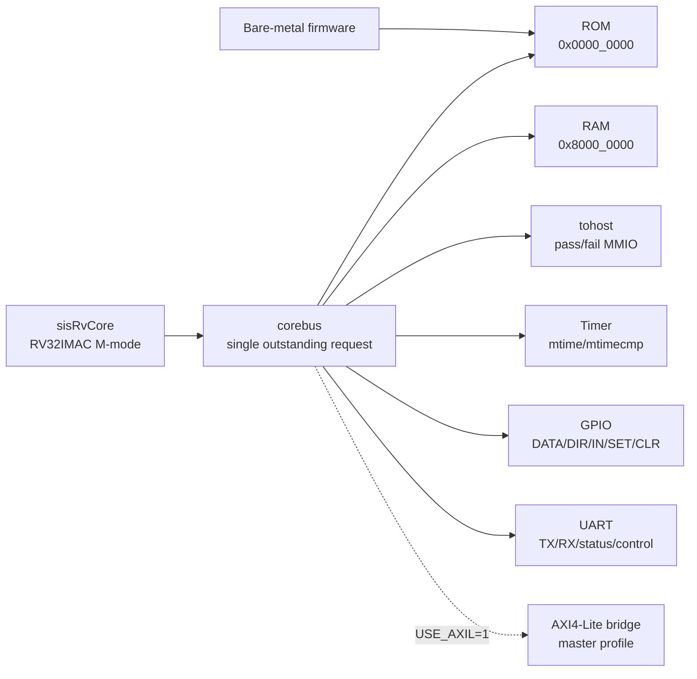
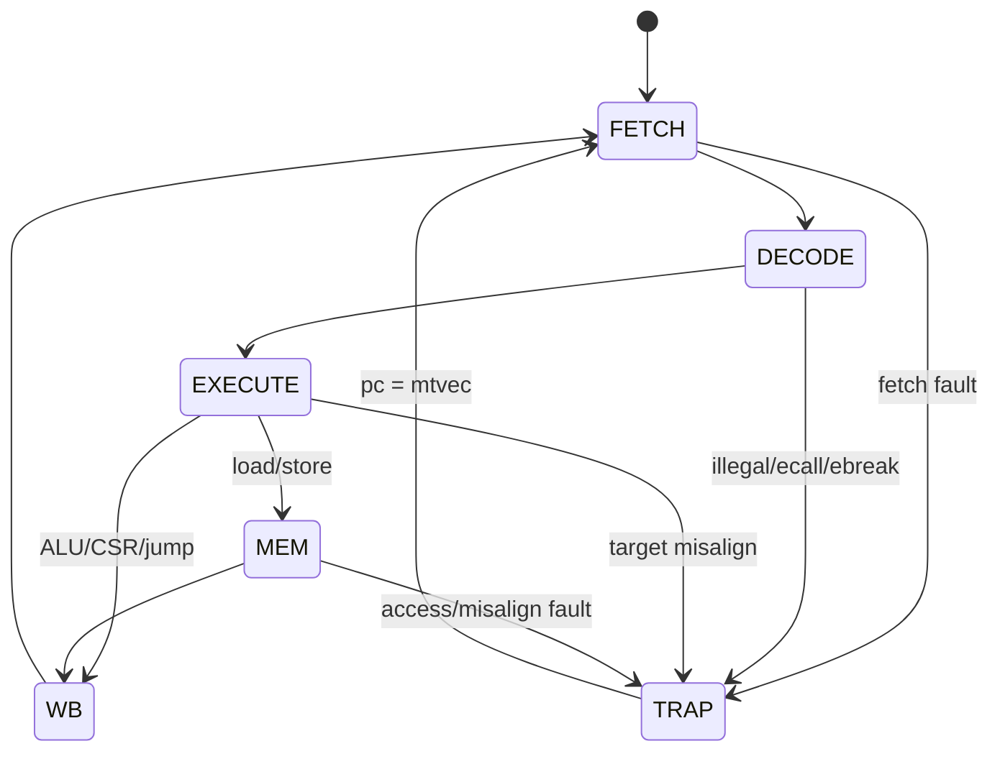
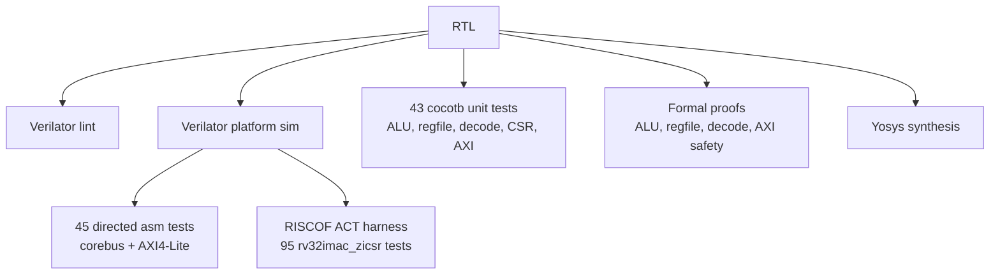

# sisrv-platform

[](https://github.com/kiranreddi/sisrv-platform/actions/workflows/ci.yml)


**ASIC-first RV32IMAC SoC platform for compact embedded RISC-V systems.**

`sisrv-platform` is an open RTL platform built around a complete RV32IMAC pipelined
core with machine-mode CSRs, precise traps, CLINT/PLIC interrupts, RISC-V Debug
subset, GPIO, UART, ROM/RAM, a simple internal corebus, and an optional AXI4-Lite
bridge.

## Why This Exists

Most small RISC-V examples stop at "runs a few instructions." Commercial embedded
cores sell a complete story: integration, debug, interrupts, verification, synthesis,
documentation, and a defensible roadmap. This repo is moving in that direction while
keeping the implementation readable and open.

**Best fit today**

- Learning and prototyping a real RV32IMAC core/platform stack.
- Embedded SoC bring-up with ROM, RAM, timer, GPIO, UART, and MMIO.
- Verilator-first firmware and RTL regression.
- AXI4-Lite integration experiments.
- Formal, cocotb, and architectural-test harness development.

**Not yet claimed**

- Not a certified or licensable commercial RISC-V IP product.
- **U-mode + PMP**: 8-region physical memory protection, M+U privilege, 70 asm regress tests.
- No cache, certified benchmark submission, or physical GDS signoff yet.

## Product Snapshot

| Area | Current capability |
|---|---|
| Core | RV32IMAC, 32 registers, in-order IF/ID/EX-MEM pipeline with independent WB/retire and direct-corebus Harvard I/D path |
| Privilege | Machine mode, core CSRs, trap entry/return, counters, WFI legal no-op |
| Platform | ROM, RAM, tohost, CLINT, PLIC, GPIO, UART |
| Interrupts | CLINT (MSIP/MTIP/MTIME), PLIC (8 prioritized sources), GPIO→PLIC mux |
| Debug | RISC-V DM 0.13 subset + JTAG DTM; halt/resume/step, abstract GPR wired to regfile while halted |
| Bus | Internal corebus plus optional AXI4-Lite bridge path |
| Verification | 45 assembly regression tests, pipeline throughput/debug-step tests, 43 cocotb tests, formal proofs, RISCOF ACT **95/95** + gated 10k lock-step co-sim |
| Implementation | Synthesizable SystemVerilog, Verilator simulation, Yosys + Sky130 STA |
| Benchmarks | Internal Verilator direct-corebus, `-O2`: `rv32imc` **1.530 CoreMark/MHz** / **0.475 DMIPS/MHz**; `rv32im` **1.522** / **0.478** (M9 fetch buffer + pipelined prefetch; `rv32imc` now edges out `rv32im` — see [docs/BENCHMARKS.md](docs/BENCHMARKS.md)) |
| Product gap | Certified benchmark submission, physical GDS signoff |

## Architecture At A Glance







## Commercial Positioning

`sisrv-platform` is closest in intent to compact embedded RISC-V MCU-class IP, but it
is still productizing. The table below is intentionally conservative.

| Product/core | Public positioning | Typical class | Where sisrv-platform stands |
|---|---|---|---|
| [SiFive Essential E Series](https://www.sifive.com/cores/essential-e-series) | Configurable 32-bit embedded RISC-V cores with commercial collateral and performance claims | MCU/embedded IP | Similar embedded target, but sisrv lacks commercial debug/security/PPA collateral |
| [AndesCore N22](https://www.andestech.com/en/products-solutions/andescore-processors/) | Compact low-power 32-bit RISC-V CPU IP with published CoreMark/DMIPS class metrics | Low-power MCU IP | sisrv now has internal direct-corebus benchmark data, but no certified benchmark/PPA signoff yet |
| [Codasip L31](https://codasip.com/press-release/2022/08/31/codasip-joins-intel-pathfinder-for-risc-v-program/) | 32-bit embedded RISC-V core with pipeline/configuration options and product tooling | Configurable embedded IP | sisrv is simpler and open, with AXI4-Lite/platform focus; configurability is early |
| sisrv-platform | Open ASIC-first RV32IMAC platform with verification and synthesis path | Productizing open MCU-class platform | Strong learning/prototyping base; not yet a commercial IP replacement |

See [`docs/INDUSTRY_COMPARISON.md`](docs/INDUSTRY_COMPARISON.md) for the full gap
analysis and product-grade roadmap.

## Current Status

| Milestone | Status |
|---|---|
| M0 - Sim harness and golden flow | Complete |
| M1 - RV32I multi-cycle core | Complete |
| M2 - CSRs and traps (M-mode) | Complete |
| M2.5 - Verification infrastructure | Complete: 43 cocotb tests + 4 formal proof sets |
| M3 - AXI4-Lite master bridge | Complete |
| M4 - Timer interrupt | Complete |
| M5 - RV32M multiply/divide | Complete: 33/33 asm tests pass |
| M6 - 3-stage pipeline | Complete: independent IF, ID, EX/MEM, and WB/retire occupancy |
| M7 - Yosys synthesis | Complete |
| M8 - OpenROAD hardening | Planned |

Detailed status lives in [`docs/status.md`](docs/status.md).

## Quickstart

### Prerequisites

- Verilator 5.038+
- RISC-V cross-compiler: `riscv64-linux-gnu-gcc`
- GNU Make
- Python 3 + cocotb
- Yosys + SymbiYosys + z3 for formal/synthesis flows

On Ubuntu/Debian:

```bash
# Core tools
sudo apt-get install gcc-riscv64-linux-gnu binutils-riscv64-linux-gnu make

# Verilator 5.038
sudo apt-get install git autoconf g++ flex bison libfl2 libfl-dev help2man ccache zlib1g-dev
cd /tmp && git clone --depth 1 --branch v5.038 https://github.com/verilator/verilator.git
cd verilator && autoconf && ./configure --prefix=/usr/local && make -j$(nproc) && sudo make install

# cocotb
pip install cocotb

# Formal verification + synthesis
sudo apt-get install yosys z3
git clone --depth 1 https://github.com/YosysHQ/sby.git /tmp/sby && sudo make -C /tmp/sby install
```

### Build And Run

```bash
make lint                     # Verilator lint
make build/sim_sisPlatformTop # Build simulation binary
make sw                       # Build assembly test hex files
make sim                      # Run basic PASS test
make regress                  # Run 45-test corebus regression
make regress-axil             # Run 45-test AXI4-Lite regression
make pipeline-debug           # Run M6 debug halt/single-step retirement check
make pipeline-throughput      # Run M6 direct-corebus ALU throughput guard
make benchmark-smoke          # Build/run short CoreMark + Dhrystone benchmark smoke
make benchmark                # Publish-length internal CoreMark + Dhrystone run
make cocotb                   # Run 43 cocotb tests
make formal                   # Run required formal proofs
make formal-axil              # Optional AXI4-Lite bounded formal safety check
make synth                    # Run Yosys synthesis
make wave                     # Open build/wave.fst in GTKWave
make clean                    # Remove build artifacts
```

Run a specific assembly test:

```bash
make run-test_addi
make run-test_branch
make run-test_load_store
```

Expected regression summary:

```text
$ make regress
=== Running regression tests ===
  PASS: test_add_sub
  PASS: test_addi
  ...
  PASS: test_uart
  PASS: test_x0
=== Results: 45/45 passed, 0 failed ===
```

## Verification

### Directed Assembly Regression

Self-checking tests cover RV32I, RV32M, CSRs, traps, timer, GPIO, UART, memory, jumps,
branches, system instructions, and stress loops.

| Category | Coverage |
|---|---|
| ALU/logic/shift/compare | ADD/SUB/ADDI, AND/OR/XOR, shifts, signed/unsigned comparisons |
| RV32M | MUL/MULH/MULHSU/MULHU/DIV/DIVU/REM/REMU and edge cases |
| Memory | Byte/halfword/word load-store, write strobes, walking RAM tests |
| Control flow | Branches, JAL/JALR, alignment behavior |
| CSR/traps | CSR ops, ECALL, EBREAK, illegal instruction, access/misalignment faults, MRET |
| Platform | Timer interrupt, MTIME writes, GPIO MMIO, UART loopback |

### cocotb Unit Tests

- ALU: directed edge cases, random stimulus, full shift sweep.
- RegFile: x0 invariant, read/write coverage, random access.
- Decode: opcode/type flags, immediates, legality, RV32M gating.
- CSR: reset, CSR ops, trap entry/return, timer pending, counters, sync trap causes.
- AXI4-Lite: reads/writes, errors, stalls, back-to-back traffic, random stress, VALID stability.

### Formal Proofs

- ALU functional correctness across all operations.
- RegFile x0 hardwired-zero invariant.
- Decoder field extraction, immediate alignment, and legal/illegal instruction behavior.
- AXI4-Lite bridge safety checks for stability and mutual exclusion.

### RISCOF / Architectural Tests

Reusable Spike co-simulation harness lives under `verification/riscof/` and
`verification/cosim/`. The ACT target runs the **rv32imac_zicsr** suite with a profile
filter: **95 tests** kept (I/M/C + Zicsr), **72 excluded** (PMP, A, privilege outside
RV32IMCZicsr). Latest short CI green run: [#27565469770](https://github.com/kiranreddi/sisrv-platform/actions/runs/27565469770).

```bash
make riscof-act
make cosim-lockstep COSIM_SEEDS=10000
make riscof-rv32i
make riscof-rv32im
```

`riscof-act` remains required in CI. The long 10k-seed retired-instruction
lock-step co-sim is restored as the final gated CI job after lint, regression,
cocotb, formal, synthesis, RISCOF, and Sky130 STA lanes are green.
Unsupported classes remain PMP, S/U modes, and A/F/D.

## Architecture Reference

### CPU Core

- ISA: RV32IMAC (`rv32imac_zicsr`).
- Microarchitecture: in-order IF/ID/EX-MEM pipeline with an independent WB/retire
  slot and direct-corebus Harvard instruction/data path.
- Privilege: M-mode CSRs including `mstatus`, `misa` (A/C/I/M), `mtvec` (direct + vectored MODE=1),
  `mepc`, `mcause`, `mtval`, `mscratch`, `mie`, `mip`, `mcycle`, and `minstret`.
- Traps: ECALL, EBREAK, illegal instruction, misaligned access, access fault, MRET.
- Atomics: LR.W/SC.W + full AMO set (AMOSWAP/ADD/XOR/AND/OR/MIN/MAX/MINU/MAXU); single-hart reservation model.
- Interrupts: CLINT at `0x0200_0000`, PLIC (8 sources) at `0x0C00_0000`.
- Debug: RISC-V Debug 0.13 subset + JTAG DTM (halt/resume/step); abstract GPR access.

### Memory Map

| Region | Base | Size | Notes |
|---|---:|---:|---|
| ROM | `0x0000_0000` | 2 MB | Reset vector, program code (ACT link.ld) |
| Timer / CLINT | `0x0200_0000` | 64 KB | MSIP, MTIMECMP, MTIME |
| PLIC | `0x0C00_0000` | 64 KB | 8 external IRQ sources |
| MMIO | `0x1000_0000` | 64 KB | tohost pass/fail signaling |
| GPIO | `0x1000_3000` | 20 B | DATA/DIR/IN/SET/CLR |
| UART | `0x1000_4000` | 20 B | TXDATA/RXDATA/STATUS/CTRL/BAUDDIV |
| RAM | `0x8000_0000` | 256 KB | Data and stack |

### Integration Profile

- Core uses a small request/response `corebus`.
- Platform can route through direct corebus fabric or AXI4-Lite (`USE_AXIL=1`).
- AXI4-Lite profile is single-outstanding, no bursts, intended for compact MCU-style integration.
- Signal-level details are in [`docs/INTERFACES.md`](docs/INTERFACES.md).

## Roadmap To Product Grade

| Priority | Work item | Why it matters |
|---|---|---|
| P1 | Benchmark-driven CPI tuning and certified-report pathway | Internal direct-corebus numbers exist; tuning/certification are separate work |
| P1 | PMP and U-mode (if Linux-class target) | Required by some embedded/Linux integrations |

## CI Pipeline

The workflow runs on every push/PR to `main`.

| Job | What it proves |
|---|---|
| Lint | RTL parses and passes Verilator lint |
| Regression | 45 assembly tests through corebus and AXI-Lite paths, plus M6 debug-step/throughput checks |
| cocotb | 43 directed/randomized unit tests |
| Formal | Required ALU, RegFile, Decode proofs; optional AXI safety |
| Synth | Yosys synthesis of core + AXI bridge (PPA stat artifact) |
| Benchmark smoke | Reduced CoreMark + Dhrystone build/run validation |
| RISCOF + co-sim | RISCOF ACT (**95/95** filtered) + final gated 10k-seed retired-instruction lock-step |

All jobs above are required and gate merges.

## Repository Map

```text
rtl/            Synthesizable SystemVerilog RTL
  core/         CPU core, ALU, decode, register file, CSRs
  bus/          Corebus fabric and AXI4-Lite bridge
  periph/       ROM, RAM, tohost, timer, GPIO, UART
tb/             Verilator harness, cocotb tests, bus models
sw/             Bare-metal BSP and assembly tests
formal/         Formal proof wrappers and scripts
verification/   RISCOF architectural-test harness
scripts/        Build and synthesis scripts
docs/           Architecture, verification, roadmap, status
```

## Documentation

- [`docs/INDUSTRY_COMPARISON.md`](docs/INDUSTRY_COMPARISON.md) - commercial benchmark and maturity plan.
- [`docs/BENCHMARKS.md`](docs/BENCHMARKS.md) - internal CoreMark/Dhrystone measurement report.
- [`docs/PLAN.md`](docs/PLAN.md) - milestone plan and exit criteria.
- [`docs/EXTENSION_ROADMAP.md`](docs/EXTENSION_ROADMAP.md) - extension order, use cases, acceptance checks.
- [`docs/MEMORY_MAP.md`](docs/MEMORY_MAP.md) - address map.
- [`docs/INTERFACES.md`](docs/INTERFACES.md) - internal bus and AXI4-Lite profile.
- [`docs/VERIFICATION.md`](docs/VERIFICATION.md) - verification strategy.
- [`docs/status.md`](docs/status.md) - detailed implementation status.

## License

License is not selected yet. Candidate options are Apache-2.0, BSD-2-Clause, or MIT.
This package does not include third-party IP.
