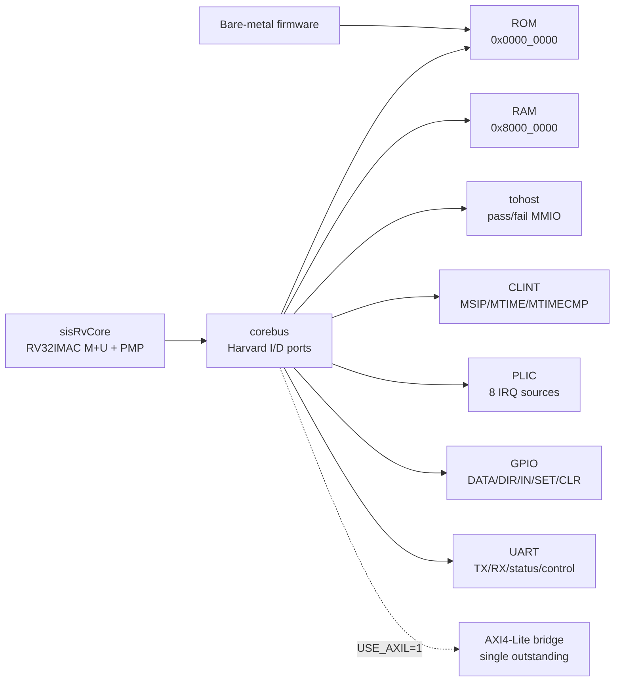
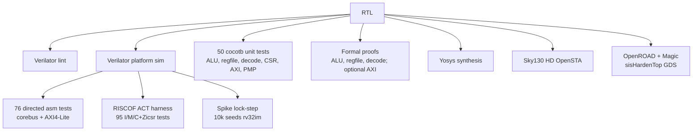

# sisrv-platform

[](https://github.com/kiranreddi/sisrv-platform/actions/workflows/ci.yml)


**ASIC-first RV32IMAC SoC platform for compact embedded RISC-V systems.**

`sisrv-platform` is an open RTL platform built around a pipelined RV32IMAC core
with M+U privilege, 8-region PMP, precise traps, CLINT/PLIC interrupts, RISC-V
Debug subset (including 2 hardware triggers), Zihpm-style HPM counters, GPIO,
UART, ROM/RAM, a simple internal corebus, and an optional AXI4-Lite bridge.

## Why This Exists

Most small RISC-V examples stop at "runs a few instructions." Commercial embedded
cores sell a complete story: integration, debug, interrupts, verification, synthesis,
documentation, and a defensible roadmap. This repo is moving in that direction while
keeping the implementation readable and open.

**Best fit today**

- Learning and prototyping a real RV32IMAC core/platform stack.
- Embedded SoC bring-up with ROM, RAM, timer, GPIO, UART, and MMIO.
- Verilator-first firmware and RTL regression.
- AXI4-Lite integration experiments.
- Formal, cocotb, and architectural-test harness development.

**Present in RTL / CI (not a commercial claim)**

- U-mode + 8-region PMP (`ENABLE_U=1`, `PMP_ENTRIES=8`), covered by directed asm + cocotb PMP tests.
- Sky130 HD hardening path for `sisHardenTop` via `make harden` (CI job green on PR #4).

**Not claimed**

- Not a certified or licensable commercial RISC-V IP product.
- No instruction cache; no certified EEMBC CoreMark submission.
- No full-`sisRvCore` GDS (Yosys cannot yet synthesize CSR/PMP SV constructs); M8 GDS is the datapath+AXI slice only.
- Per-push RISCOF ACT lane is the I/M/C+Zicsr filter (**95** tests), not full A/PMP/privilege ACT.

## Product Snapshot

| Area | Current capability |
|---|---|
| Core | RV32IMAC, 32 registers, in-order IF/ID/EX-MEM pipeline with independent WB/retire and direct-corebus Harvard I/D path; M9 1-word fetch buffer + sequential prefetch |
| Privilege | M+U (`ENABLE_U=1`), core CSRs, trap entry/return, Zicntr counters, Zihpm-style `mhpmcounter3..31` / `mhpmevent3..31`, WFI legal no-op, 8-region PMP |
| Platform | ROM, RAM, tohost, CLINT, PLIC, GPIO, UART |
| Interrupts | CLINT (MSIP/MTIP/MTIME), PLIC (8 prioritized sources), GPIO→PLIC mux |
| Debug | RISC-V DM 0.13 subset + JTAG DTM; halt/resume/step, abstract GPR while halted; 2 hardware triggers (exec/load/store breakpoints) |
| Bus | Internal corebus plus optional AXI4-Lite bridge path |
| Verification | 78 asm sources / 76 regress (+ pipeline/fetch/debug guards), **55** cocotb tests (incl. Decompress), formal (ALU/RegFile/Decode; optional AXI), RISCOF ACT **95/95** I/M/C+Zicsr subset, per-push Spike lock-step **rv32im** + **64-seed rv32imac+U/PMP smoke**, plan: [`docs/UVM_COVERAGE_PLAN.md`](docs/UVM_COVERAGE_PLAN.md) |
| Implementation | Synthesizable SystemVerilog; Verilator sim; Yosys generic synth; Sky130 HD OpenSTA (`make sta-sky130`); OpenROAD+Magic harden for `sisHardenTop` (`make harden`) |
| Benchmarks | Internal Verilator direct-corebus, `-O2` (not EEMBC-certified): `rv32imc_zicsr` **1.530 CoreMark/MHz** / **0.475 DMIPS/MHz**; `rv32im_zicsr` **1.522** / **0.478** — see [docs/BENCHMARKS.md](docs/BENCHMARKS.md) |
| Open items | Certified benchmark submission; full-core GDS; A/PMP/privilege ACT + imac+U/PMP lock-step are opt-in/nightly, not the per-push gate |

## Architecture At A Glance





## Commercial Positioning

`sisrv-platform` is closest in intent to compact embedded RISC-V MCU-class IP, but it
is still productizing. The table below is intentionally conservative.

| Product/core | Public positioning | Typical class | Where sisrv-platform stands |
|---|---|---|---|
| [SiFive Essential E Series](https://www.sifive.com/cores/essential-e-series) | Configurable 32-bit embedded RISC-V cores with commercial collateral and performance claims | MCU/embedded IP | Similar embedded target, but sisrv lacks commercial debug/security/PPA collateral |
| [AndesCore N22](https://www.andestech.com/en/products-solutions/andescore-processors/) | Compact low-power 32-bit RISC-V CPU IP with published CoreMark/DMIPS class metrics | Low-power MCU IP | sisrv has internal direct-corebus benchmark data + Sky130 STA/harden slice; no certified EEMBC or commercial PPA signoff |
| [Codasip L31](https://codasip.com/press-release/2022/08/31/codasip-joins-intel-pathfinder-for-risc-v-program/) | 32-bit embedded RISC-V core with pipeline/configuration options and product tooling | Configurable embedded IP | sisrv is simpler and open, with AXI4-Lite/platform focus; configurability is early |
| sisrv-platform | Open ASIC-first RV32IMAC platform with verification and synthesis path | Productizing open MCU-class platform | Strong learning/prototyping base; not yet a commercial IP replacement |

See [`docs/INDUSTRY_COMPARISON.md`](docs/INDUSTRY_COMPARISON.md) for the full gap
analysis and product-grade roadmap.

## Current Status

Facts below match milestone docs and the latest CI run on PR
[#4](https://github.com/kiranreddi/sisrv-platform/pull/4)
([actions run #30611181758](https://github.com/kiranreddi/sisrv-platform/actions/runs/30611181758)).

| Milestone | Status |
|---|---|
| M0 - Sim harness and golden flow | Complete |
| M1 - RV32I core | Complete (now superseded by the M6 pipeline) |
| M2 - CSRs and traps | Complete (M-mode baseline; U-mode/PMP added later) |
| M2.5 - Verification infrastructure | Complete: **50** cocotb tests + required formal (ALU/RegFile/Decode; optional AXI) |
| M3 - AXI4-Lite master bridge | Complete (`regress-axil` / `regress-axil-stall` in CI; 1000-seed stall is schedule/opt-in) |
| M4 - Timer interrupt | Complete (CLINT/PLIC platform interrupts present) |
| M5 - RV32M multiply/divide | Complete (`ENABLE_M`, `test_rv32m`) |
| M6 - Pipeline | Complete: IF/ID/EX-MEM + WB/retire; Harvard I/D; forwarding/stalls/flushes |
| M7 - Yosys synthesis | Complete (`make synth`; CI uploads `ppa-synth-report`) |
| M8 - OpenROAD hardening | Complete for `sisHardenTop` (`make harden`; CI job green). Full-`sisRvCore` GDS deferred — see [`docs/HARDENING.md`](docs/HARDENING.md) |

Post-M6 / plan extensions also present: RV32C, RV32A, vectored `mtvec`, U-mode + PMP, HPM counters, M9 fetch buffer + prefetch, hardware debug triggers. Details: [`docs/status.md`](docs/status.md).

## Quickstart

### Prerequisites

- Verilator **5.050+** (CI builds `v5.050`)
- RISC-V cross-compiler: `riscv64-linux-gnu-gcc`
- GNU Make
- Python 3 + **cocotb 2.0.1** (needs Verilator ≥ 5.036)
- Yosys + SymbiYosys + z3 for formal/synthesis flows

On Ubuntu/Debian:

```bash
# Core tools
sudo apt-get install gcc-riscv64-linux-gnu binutils-riscv64-linux-gnu make

# Verilator 5.050 (or: VERILATOR_REF=v5.050 bash scripts/ci/install_verilator.sh)
sudo apt-get install git autoconf g++ flex bison libfl2 libfl-dev help2man ccache zlib1g-dev liblz4-dev
cd /tmp && git clone --depth 1 --branch v5.050 https://github.com/verilator/verilator.git
cd verilator && autoconf && ./configure --prefix=/usr/local && make -j$(nproc) && sudo make install

# cocotb 2.x
python3 -m pip install 'cocotb==2.0.1'

# Formal verification + synthesis
sudo apt-get install yosys z3
git clone --depth 1 https://github.com/YosysHQ/sby.git /tmp/sby && sudo make -C /tmp/sby install
```

### Build And Run

```bash
make lint                     # Verilator lint
make build/sim_sisPlatformTop # Build simulation binary
make sw                       # Build assembly test hex files
make sim                      # Run basic PASS test
make regress                  # Run 76-test corebus regression
make regress-axil             # Run 76-test AXI4-Lite regression
make regress-axil-stall       # AXI path with slave stall injection
make pipeline-debug           # Debug halt/single-step retirement check
make pipeline-throughput      # Direct-corebus ALU throughput guard
make fetch-throughput         # Fetch-buffer throughput guard
make benchmark-smoke          # Short CoreMark + Dhrystone smoke
make benchmark                # Publish-length internal CoreMark + Dhrystone
make cocotb                   # Run 50 cocotb tests
make formal                   # Required formal proofs (ALU/RegFile/Decode)
make formal-axil              # Optional AXI4-Lite bounded formal safety check
make synth                    # Yosys generic synthesis
make sta-sky130               # Sky130 HD OpenSTA (needs OpenSTA + liberty fetch)
make harden                   # M8 Sky130 OpenROAD+Magic path for sisHardenTop
make wave                     # Open build/wave.fst in GTKWave
make clean                    # Remove build artifacts
```

OpenROAD/Magic tools are not installed by the Ubuntu packages above. For `make harden`,
use a tool install that provides `yosys`, `openroad`, and `magic` (CI uses micromamba
`litex-hub` packages). See [`docs/HARDENING.md`](docs/HARDENING.md).

Run a specific assembly test:

```bash
make run-test_addi
make run-test_branch
make run-test_load_store
```

Expected regression summary:

```text
$ make regress
=== Running regression tests ===
  PASS: test_add_sub
  PASS: test_addi
  ...
  PASS: test_uart
  PASS: test_x0
=== Results: 76/76 passed, 0 failed ===
```

## Verification

### Directed Assembly Regression

Self-checking tests cover RV32I, RV32M, CSRs, traps, timer, GPIO, UART, memory, jumps,
branches, system instructions, and stress loops.

| Category | Coverage |
|---|---|
| ALU/logic/shift/compare | ADD/SUB/ADDI, AND/OR/XOR, shifts, signed/unsigned comparisons |
| RV32M | MUL/MULH/MULHSU/MULHU/DIV/DIVU/REM/REMU and edge cases |
| Memory | Byte/halfword/word load-store, write strobes, walking RAM tests |
| Control flow | Branches, JAL/JALR, alignment behavior |
| CSR/traps | CSR ops, ECALL, EBREAK, illegal instruction, access/misalignment faults, MRET |
| Platform | Timer interrupt, MTIME writes, GPIO MMIO, UART loopback |

### cocotb Unit Tests

**50** tests total (`@cocotb.test` count in `tb/cocotb/`):

- ALU (3): directed edge cases, random stimulus, full shift sweep.
- RegFile (4): x0 invariant, read/write coverage, random access.
- Decode (11): opcode/type flags, immediates, legality, RV32M gating.
- CSR (14): reset, CSR ops, trap entry/return, timer pending, counters, sync trap causes.
- AXI4-Lite (11): reads/writes, errors, stalls, back-to-back traffic, random stress, VALID stability.
- PMP (7): matcher / permission lane coverage.

### Formal Proofs

- ALU functional correctness across all operations.
- RegFile x0 hardwired-zero invariant.
- Decoder field extraction, immediate alignment, and legal/illegal instruction behavior.
- AXI4-Lite bridge safety checks for stability and mutual exclusion.

### RISCOF / Architectural Tests

Harnesses live under `verification/riscof/` and `verification/cosim/`.

- Per-push `make riscof-act`: **rv32imac_zicsr** ACT with a filter — **95** tests kept
  (I/M/C + Zicsr). A / PMP / privilege paths are excluded from this lane.
- Opt-in/nightly: `make riscof-act-full` and `make cosim-lockstep-imac-upmp`
  (workflow `schedule` or `workflow_dispatch` with `extended_compliance=true`).
- Per-push lock-step: `make cosim-lockstep COSIM_SEEDS=10000` uses the **rv32im**
  profile (final gated CI job).

```bash
make riscof-act
make cosim-lockstep COSIM_SEEDS=10000
make riscof-act-full                 # opt-in / nightly
make cosim-lockstep-imac-upmp        # opt-in / nightly
```

RTL implements A, U-mode, and PMP; those are covered by directed tests today.
They are **not** part of the per-push ACT/co-sim gate. S-mode and F/D are not
implemented.

## Architecture Reference

### CPU Core

- ISA: RV32IMAC + Zicsr (`rv32imac_zicsr`); defaults `ENABLE_M/C/A/U=1`, `PMP_ENTRIES=8`.
- Microarchitecture: in-order IF/ID/EX-MEM pipeline with independent WB/retire,
  Harvard I/D corebus ports, M9 1-word fetch buffer + sequential prefetch.
- Privilege: M+U; CSRs include `mstatus`, `misa`, `mtvec` (direct + vectored MODE=1),
  `mepc`, `mcause`, `mtval`, `mscratch`, `mie`, `mip`, `mcycle`/`minstret`,
  `mcounteren`/`mcountinhibit`, PMP CSRs, and Zihpm-style `mhpmcounter3..31` /
  `mhpmevent3..31`.
- Traps: ECALL, EBREAK, illegal instruction, misaligned access, access fault, MRET;
  U-mode privilege violations when `ENABLE_U=1`.
- Atomics: LR.W/SC.W + full AMO set; single-hart reservation model.
- Interrupts: CLINT at `0x0200_0000`, PLIC (8 sources) at `0x0C00_0000`.
- Debug: RISC-V Debug 0.13 subset + JTAG DTM (halt/resume/step); abstract GPR access;
  2 hardware triggers (`tdata1`/`tdata2` mcontrol — execute/load/store breakpoints).

### Memory Map

| Region | Base | Size | Notes |
|---|---:|---:|---|
| ROM | `0x0000_0000` | 2 MB | Reset vector, program code (ACT link.ld) |
| Timer / CLINT | `0x0200_0000` | 64 KB | MSIP, MTIMECMP, MTIME |
| PLIC | `0x0C00_0000` | 4 MB | 8 external IRQ sources (context @ `+0x20_0000`) |
| MMIO | `0x1000_0000` | 64 KB | tohost pass/fail signaling |
| GPIO | `0x1000_3000` | 20 B | DATA/DIR/IN/SET/CLR |
| UART | `0x1000_4000` | 20 B | TXDATA/RXDATA/STATUS/CTRL/BAUDDIV |
| RAM | `0x8000_0000` | 256 KB | Data and stack |

### Integration Profile

- Core uses a small request/response `corebus`.
- Platform can route through direct corebus fabric or AXI4-Lite (`USE_AXIL=1`).
- AXI4-Lite profile is single-outstanding, no bursts, intended for compact MCU-style integration.
- Signal-level details are in [`docs/INTERFACES.md`](docs/INTERFACES.md).

## Roadmap To Product Grade

Prioritized backlog lives in [`docs/BACKLOG.md`](docs/BACKLOG.md). Items still open
as of this README (not already landed):

| Priority | Work item | Notes |
|---|---|---|
| P0/P1 | Full-ISA RISCOF + imac/U/PMP lock-step honesty | Opt-in/nightly lanes exist; per-push gate still uses I/M/C ACT + rv32im cosim |
| P1 | Benchmark-driven CPI tuning / certified-report pathway | Internal numbers in `docs/BENCHMARKS.md`; not EEMBC-certified |
| P1 | Full-`sisRvCore` GDS | Blocked on Yosys SV frontend / array flattening (`docs/HARDENING.md`) |
| P1/P2 | Debug `action=1` halt into DM; AXI4 bursts; I-cache; CLIC | See backlog B7–B10 |

## CI Pipeline

Workflow: [`.github/workflows/ci.yml`](.github/workflows/ci.yml). Runs on push/PR to
`main`, plus nightly `schedule` and manual `workflow_dispatch`.

| Job | When | What it proves |
|---|---|---|
| Build Verilator (`v5.050`) | every PR/push | Shared Verilator install artifact for sim jobs |
| Verilator Lint | every PR/push | RTL lint-clean |
| Assembly Regression | every PR/push | 76 asm tests corebus + AXI-Lite + stall path; pipeline/fetch/debug guards |
| cocotb Tests (55) | every PR/push | ALU, RegFile, Decode, Decompress, CSR, AXI-Lite, PMP (cocotb 2.0.1) |
| Unit Coverage Baseline | every PR/push | Informational Verilator `--coverage` (Decompress) |
| Lock-step Smoke (imac+U/PMP) | every PR/push | 64-seed B2 triage (10k nightly) |
| Software Artifacts (UVM/cocotb) | every PR/push | Prebuilt asm hex/elf for hosts without `riscv-gcc` |
| Formal | every PR/push | Required ALU/RegFile/Decode proofs |
| Yosys Synthesis | every PR/push | Generic synth; uploads `ppa-synth-report` |
| Benchmark Smoke | every PR/push | Reduced CoreMark + Dhrystone |
| RISCOF ACT (95 I/M/C+Zicsr) | every PR/push | Filtered architectural tests |
| Sky130 STA | every PR/push | OpenSTA WNS/TNS/Fmax; uploads `sta-sky130-report` |
| OpenROAD Sky130 Harden (M8) | every PR/push | `make harden` for `sisHardenTop`; uploads harden artifacts |
| 10k-seed Lock-step Co-sim | every PR/push (final gate) | Spike lock-step, **rv32im** profile |
| AXI-Lite 1000-seed Stall Nightly | schedule / extended dispatch | M3 stretch coverage |
| RISCOF ACT Full + imac+U/PMP cosim | schedule / extended dispatch | Opt-in expanded compliance |

Latest PR #4 CI: all per-push jobs **passed**; the three schedule/opt-in jobs were
**skipped** (expected on a normal PR).

## Repository Map

```text
rtl/            Synthesizable SystemVerilog RTL
  core/         CPU core, ALU, decode, regfile, CSR, PMP, decompress
  bus/          Corebus fabric and AXI4-Lite bridge
  periph/       ROM, RAM, tohost, CLINT, PLIC, GPIO, UART
  debug/        Debug Module + JTAG DTM
  asic/         Sky130 hardenable slice (`sisHardenTop`)
tb/             Verilator harness, cocotb tests, bus models
sw/             Bare-metal BSP, asm tests, CoreMark/Dhrystone ports
formal/         Formal proof wrappers and scripts
verification/   RISCOF + Spike lock-step harnesses
scripts/        Synth, STA, OpenROAD, Magic, benchmark helpers
docs/           Architecture, verification, roadmap, status, hardening
third_party/    Vendored CoreMark/Dhrystone (see NOTICE); Sky130 files fetched on demand
```

## Documentation

- [`docs/status.md`](docs/status.md) — detailed implementation status.
- [`docs/HARDENING.md`](docs/HARDENING.md) — M8 OpenROAD/Magic Sky130 flow and deltas.
- [`docs/PPA_DATASHEET.md`](docs/PPA_DATASHEET.md) — area/timing/power reference.
- [`docs/BENCHMARKS.md`](docs/BENCHMARKS.md) — internal CoreMark/Dhrystone report.
- [`docs/PLAN.md`](docs/PLAN.md) — milestone plan and exit criteria.
- [`docs/BACKLOG.md`](docs/BACKLOG.md) — prioritized engineering backlog.
- [`docs/INDUSTRY_COMPARISON.md`](docs/INDUSTRY_COMPARISON.md) — gap analysis vs product IP.
- [`docs/INTEGRATION_GUIDE.md`](docs/INTEGRATION_GUIDE.md) / [`docs/PROGRAMMERS_REFERENCE.md`](docs/PROGRAMMERS_REFERENCE.md).
- [`docs/MEMORY_MAP.md`](docs/MEMORY_MAP.md), [`docs/INTERFACES.md`](docs/INTERFACES.md), [`docs/VERIFICATION.md`](docs/VERIFICATION.md).
- [`docs/SW_ARTIFACTS.md`](docs/SW_ARTIFACTS.md) — CI prebuilt hex/elf for UVM & cocotb when local `riscv-gcc` is unavailable.
- [`docs/MULTISIM_VERIFICATION.md`](docs/MULTISIM_VERIFICATION.md) — Questa / VCS / Xcelium + SV TB.

## License

Apache License 2.0 — see [`LICENSE`](LICENSE) and [`NOTICE`](NOTICE).
Vendored material under `third_party/` keeps its upstream licenses (recorded in
each tree’s `SOURCE.md`).
